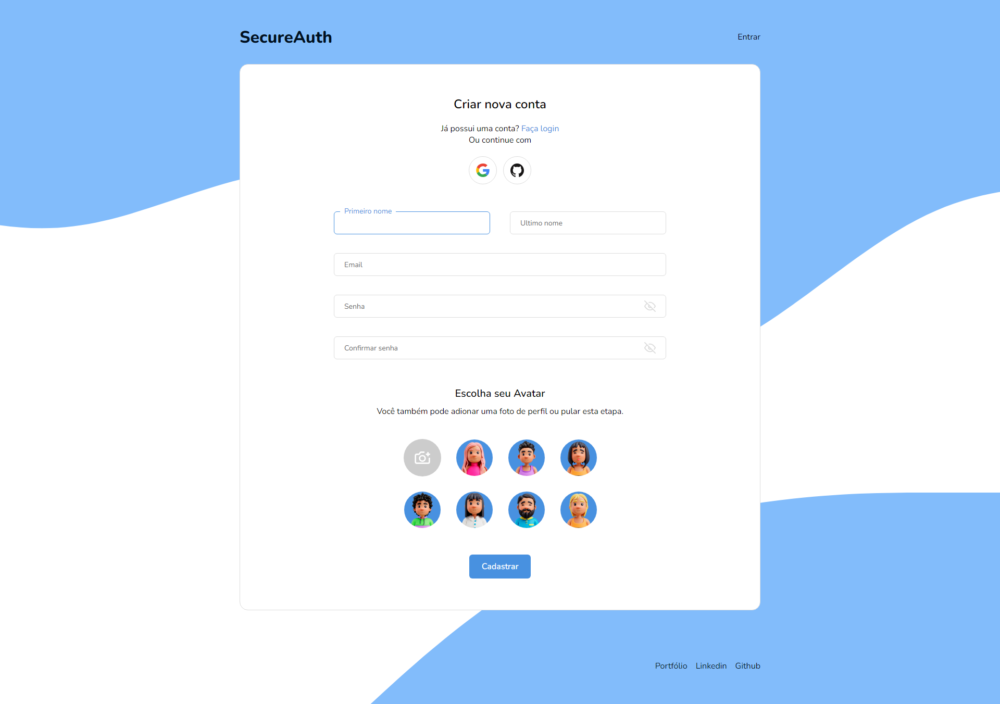

# :lock: SecureAuth - Sistema de autenticação

Este é um projeto full stack de autenticação de usuários, permite que os usuários se autentiquem via e-mail e senha, bem como através de contas do Google e do GitHub. O projeto foi desenvolvido para fins de estudo :)

## :computer: Funcionalidades principais

- Autenticar usuários com e-mail e senha
- Autenticar usuários com contas do Google e do GitHub
- Selecionar um avatar ou carregar uma foto para a imagem de perfil
- Alterar a imagem de perfil depois de logado (apenas login com email e senha)

## :hammer: Tecnologias utilizadas

- **Firebase:** como o back-end do projeto
- **React hook form + zod:** para fazer a validação dos formulários
- **Styled-components + Framer Motion:** para o estilo e animações

**Link para o site:** [https://secureauth.netlify.app/](https://secureauth.netlify.app/)

### :raising_hand: Autor

- **Website (portfólio):**  [Gabriel M.](https://gmouradev.netlify.app/)
- **Linkedin:**  [Gabriel Moura](https://www.linkedin.com/in/gabriel-moura-b63382161/)
